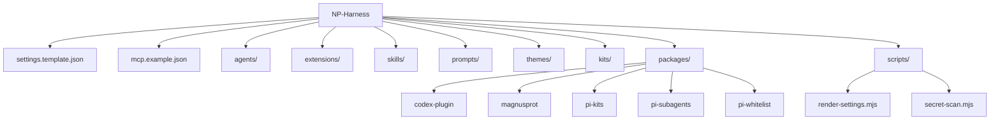

# NP-Harness

[](SECURITY.md)
[](LICENSE)

Public-safe Pi coding-agent harness configuration for NorthProt workflows.

NP-Harness is a sanitized, restorable snapshot of Pi customizations: global agent rules, subagent definitions, local extensions, skills, prompts, themes, kits, and local Pi packages.

---

## Features

- Portable Pi settings template in `settings.template.json`.
- Placeholder MCP configuration in `mcp.example.json`; real MCP credentials stay local.
- Local Pi extensions under `extensions/`:
  - memory and `.remember/` maintenance hooks
  - safety hooks for destructive commands and protected files
  - statusline/theme UI customization
  - input triage hints for workflow skills
- Local skills under `skills/`, including document, spreadsheet, PDF, frontend, Gmail/Drive/Calendar, MCP builder, and artifact workflows.
- Package-style add-ons under `packages/`:
  - `codex-plugin` for Codex companion integration
  - `magnusprot` workflow skills
  - `pi-kits` catalog commands
  - `pi-subagents` autonomous subagent extension
  - `pi-whitelist` tool permission system
- Public-safety scanner in `scripts/secret-scan.mjs`.

---

## Architecture



No Docker, systemd unit, Procfile, or compose service is defined in this repository.

---

## Quick Start

Restore into the default Pi agent directory:

```bash
git clone https://github.com/NorthProt-Inc/NP-Harness.git
cd NP-Harness
mkdir -p ~/.pi
rsync -a --exclude .git ./ ~/.pi/agent/
cd ~/.pi/agent
npm install --ignore-scripts
node scripts/render-settings.mjs
cp mcp.example.json mcp.json
$EDITOR mcp.json
```

Then start Pi:

```bash
pi --no-session --verbose
```

See [`RESTORE.md`](RESTORE.md) for the full restore procedure.

---

## Dev Commands

The root manifest currently has no `scripts` entries. Use the direct commands below.

| Purpose | Command |
|---|---|
| Install root dependencies | `npm install --ignore-scripts` |
| Render local settings | `node scripts/render-settings.mjs` |
| Public-safety scan | `node scripts/secret-scan.mjs` |
| Validate JSON examples | `python3 -m json.tool settings.template.json >/dev/null && python3 -m json.tool mcp.example.json >/dev/null` |
| Audit root runtime deps | `npm audit --omit=dev` |
| Typecheck `pi-kits` | `cd packages/pi-kits && npm install --ignore-scripts && npm run typecheck` |
| Test `pi-kits` | `cd packages/pi-kits && npm test` |

Package-level scripts are defined in `packages/pi-kits`, `packages/pi-subagents`, and `packages/pi-whitelist`.

---

## Environment Variables

| Variable | Used by | Required | Description |
|---|---:|---:|---|
| `PI_AGENT_DIR` | `scripts/render-settings.mjs`, `packages/pi-kits` | No | Preferred target Pi agent directory override. |
| `PI_CODING_AGENT_DIR` | Pi, `scripts/render-settings.mjs`, `packages/pi-kits`, `pi-subagents` tests | No | Pi's native config directory override. |
| `HOME` | restore scripts and path defaults | Yes | Used to derive `~/.pi/agent` when no override is set. |
| `TAVILY_API_KEY` | `mcp.example.json` | No | Placeholder for Tavily MCP; keep real value local only. |

See [`.env.example`](.env.example). Do not commit a real `.env` file.

---

## Testing and Verification

Before publishing changes:

```bash
node scripts/secret-scan.mjs
python3 -m json.tool settings.template.json >/dev/null
python3 -m json.tool mcp.example.json >/dev/null
npm audit --omit=dev
cd packages/pi-kits && npm run typecheck && npm test
```

Also verify that no private runtime files are tracked:

```bash
git ls-files | grep -E '(^|/)(auth\.json|mcp\.json|settings\.json|node_modules/|sessions/|logs/|memory/|\.remember/|codex-plugin-data/|backups/|\.pi/|\.env$|\.env\.)' | grep -v '^\.env\.example$'
```

The command should print nothing.

---

## Security Model

This repository is intended to be safe for a public GitHub repository. It excludes:

- `auth.json`, live `mcp.json`, API keys, tokens, and OAuth state
- MCP caches and generated metadata
- `sessions/`, `logs/`, `.remember/`, campaign state, and backups
- personal memory files under `memory/`
- `node_modules/` and nested package runtime state

See [`SECURITY.md`](SECURITY.md).

---

## License

MIT. See [`LICENSE`](LICENSE).
