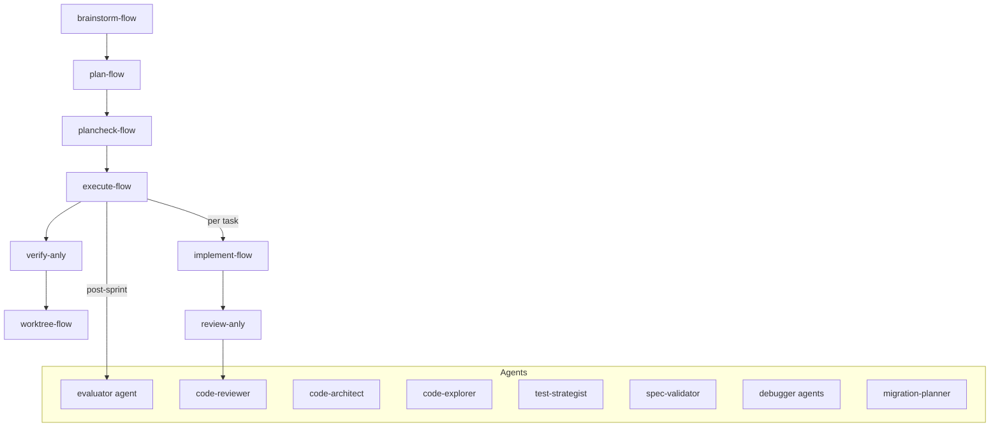

# magnusprot

Personal Pi skill suite for workflow orchestration, TDD-first development, systematic debugging, multi-perspective code review, and system utilities.

---

## Install

This branch is Pi-native. The package manifest exposes skills via:

```json
{
  "pi": {
    "skills": ["skills/*"]
  }
}
```

Install or link this repository using Pi's package workflow, then reload Pi. Invoke skills as `/skill:<name>` (for example `/skill:plan-flow`). Do not assume Claude-plugin namespacing such as `/magnusprot:<skill-name>` in Pi.

### Custom agents

Pi package docs do not document package-level agent loading. Custom agents used by these workflows must be available through pi-subagents discovery:

- project-local `.pi/agents/<name>.md`
- global `~/.pi/agent/agents/<name>.md`

The top-level `agents/` directory in this repository is source material for those files; it is not assumed to load automatically from `package.json`. Prefer copying individual files into the discovery directory:

```bash
mkdir -p ~/.pi/agent/agents
cp agents/code-reviewer.md ~/.pi/agent/agents/code-reviewer.md
cp agents/evaluator.md ~/.pi/agent/agents/evaluator.md
```

### Legacy compatibility

Some skills still read `.claude/` state for compatibility. New Pi-native campaign state is being migrated to `.pi/campaigns/<campaign-id>/`.

---

## Architecture



---

## Skills (19)

In Pi, invoke skills with `/skill:<skill-name>`.

### Model Tiers

Frontmatter fields such as `model`, `user-invocable`, and `argument-hint` are legacy Claude/plugin hints in this repository. Pi skill loading is driven by `name` and `description`; do not treat those legacy fields as Pi runtime controls.

| Tier | Model | Skills |
|------|-------|--------|
| **Light** | `haiku` | clean-dev, commit-dev, deps-dev, docs-dev, init-dev |
| **Medium** | `sonnet` | perf-anly, respond-anly, research-sys, security-dev, worktree-flow |
| **Heavy** | inherit | brainstorm-flow, debug-anly, execute-flow, implement-flow, plan-flow, plancheck-flow, review-anly, simplify-anly, verify-anly |

### Core Workflow Chain

`brainstorm-flow` &rarr; `plan-flow` &rarr; `plancheck-flow` &rarr; `execute-flow` &rarr; `verify-anly`

Supporting: `implement-flow`, `review-anly`, `worktree-flow`

### Analysis & Review

| Skill | Description |
|-------|-------------|
| `review-anly` | 7-perspective code quality analysis |
| `simplify-anly` | Complexity audit — dead code, DRY, YAGNI, coupling |
| `perf-anly` | Performance analysis — bottlenecks, complexity, N+1 queries |
| `respond-anly` | Code review feedback response — verify before agreeing |
| `verify-anly` | Plan compliance + execution evidence gate |

### Development

| Skill | Description |
|-------|-------------|
| `init-dev` | Project context loading — scan configs, deps, git state |
| `commit-dev` | Conventional Commits + pre-commit typecheck/lint gate |
| `clean-dev` | System cleanup (multi-distro: apt/dnf) |
| `deps-dev` | Dependency status and security audit |
| `docs-dev` | Documentation generation and audit |
| `security-dev` | Security scan — secrets, injection, unsafe APIs, MCP/plugin config audit |

### Workflow

| Skill | Description |
|-------|-------------|
| `brainstorm-flow` | Requirements exploration — shape design before implementation |
| `plan-flow` | TDD plan + campaign/sprint contracts + context7 library lookup |
| `plancheck-flow` | Plan review — catch over-engineering and scope creep |
| `execute-flow` | Plan execution with campaign and Pi handoff state integration |
| `implement-flow` | TDD-first implementation with test-strategist dispatch |
| `worktree-flow` | Git worktree lifecycle — setup, develop, merge/PR |

### System & Utilities

| Skill | Description |
|-------|-------------|
| `debug-anly` | Root cause analysis before fixing |
| `research-sys` | Library/API research using codebase search plus context7/tavily when available |

---

## Agents (9)

| Agent | Description |
|-------|-------------|
| `code-reviewer` | Plan-aligned review with 7-perspective framework |
| `code-architect` | System design evaluation and structural trade-offs |
| `code-explorer` | Deep codebase exploration and execution path tracing |
| `evaluator` | Black-box live-app testing via Playwright (5-phase: happy path, edge cases, mobile, regression, API) |
| `silent-failure-hunter` | Finds bugs that don't throw errors — empty results, missing data, swallowed exceptions |
| `incident-investigator` | Error chain tracing for loud failures — stack traces, crash analysis |
| `test-strategist` | Test design — edge cases, coverage gaps, test architecture |
| `migration-planner` | Version upgrades and API deprecation response |
| `spec-validator` | Requirements compliance validation against specs/PRDs |

---

## Campaign System

magnusprot supports multi-session project campaigns. The Pi-native target backend is `.pi/campaigns/<campaign-id>/` with `campaign.json`, `handoff.md`, and sprint contracts under `sprints/`.

- **plan-flow** generates campaign state + sprint contracts
- **execute-flow** resumes campaigns across sessions (reads `continuation_prompt` and Pi handoff notes)
- **verify-anly** validates sprint contract compliance (Gate 3)
- **evaluator** agent runs Playwright black-box testing post-sprint

Legacy `.claude/campaign.json` and `.claude/sprint-contracts/<project>-<N>.json` may still be read for compatibility during migration.

Schemas are documented in `schemas/campaign.schema.json` and `schemas/sprint-contract.schema.json`; see `docs/pi-workflow.md` for resume and migration rules.

---

## Multi-distro Support

`clean-dev` detects the package manager at runtime (`dnf`/`apt`) and adapts commands accordingly. Includes Pop!_OS safety features: NVIDIA/GPU package protection, sudo policy detection, generic-hwe kernel protection.

---

## License

[MIT](LICENSE)
