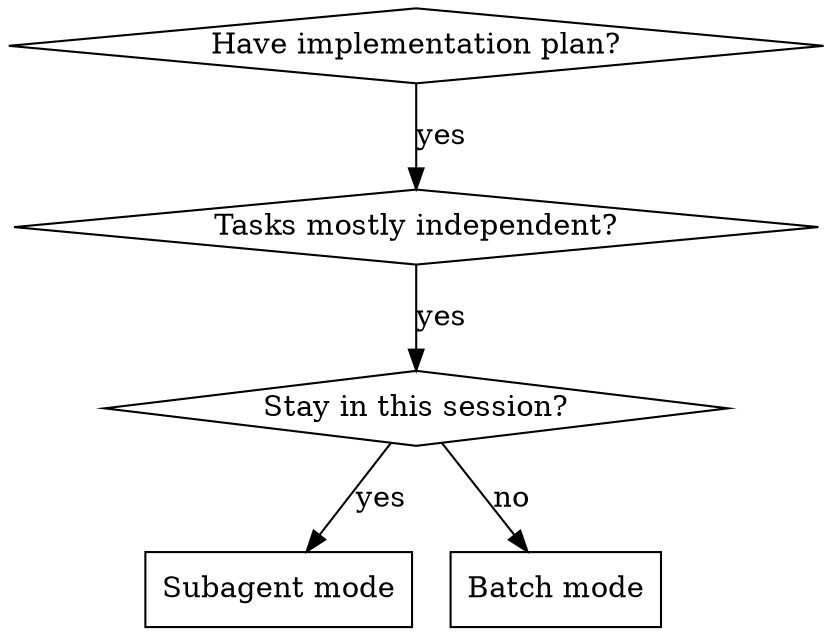
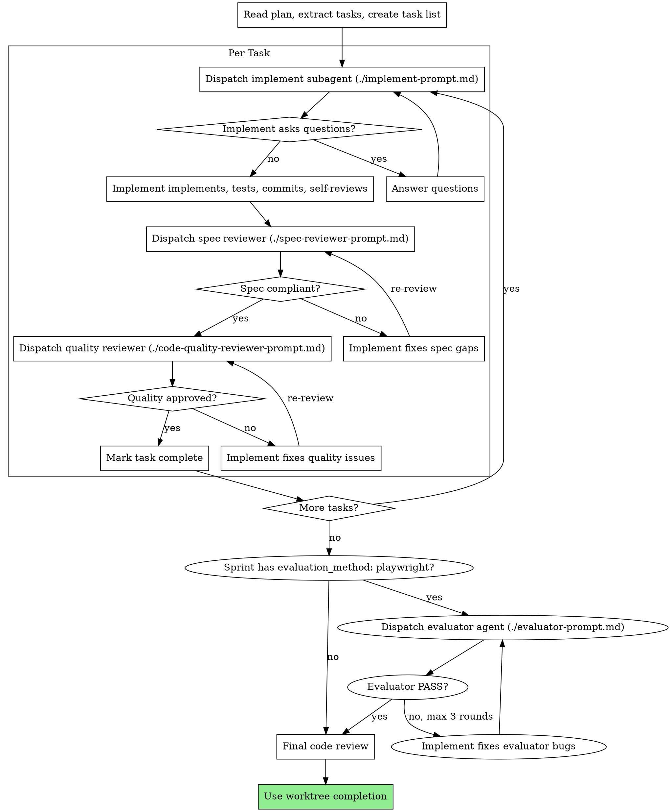

# Plan Execution

## Overview

Three execution modes for implementation plans:

- **Batch Mode:** Execute tasks in batches of 3, report for review between batches. Best for separate sessions or when subagents are unavailable.
- **Orchestrator Mode:** Dispatch fresh subagent per task with two-stage review (spec then quality). Best for same-session execution.
- **Resume Mode:** Load campaign state from `.pi/campaigns/<campaign-id>/` or legacy fallback and continue from `current_phase/current_sprint`.

**Announce at start:** "I'm using the execute-flow skill to implement this plan."

---

## Common Prerequisites

### Step 0: Campaign Resume Check

Before anything else, check for active session state in this order:

1. **Explicit campaign path from the user** — load that `campaign.json` first.
2. **Active Pi campaign** — load the newest `.pi/campaigns/*/campaign.json` where `current_phase` is not `"complete"`.
3. **Pi handoff note** — read `.pi/campaigns/<campaign-id>/handoff.md` when campaign JSON is missing, corrupt, blocked, or context was compacted mid-task.
4. **Legacy `.remember/remember.md`** — read only as supplemental context if it already exists. Do not invoke any legacy remember command.
5. **Legacy Claude campaign** — read `.claude/campaign.json` and `.claude/sprint-contracts/` only if no active Pi campaign exists.
6. **No campaign** — proceed normally with the supplied plan.

If Pi campaign state exists and `current_phase` is not `"complete"`:
- Load and display `continuation_prompt`.
- Read the current sprint contract from `.pi/campaigns/<campaign-id>/sprints/<NNN>.json` where `current_sprint: 1` maps to `001.json`.
- If both Pi and legacy Claude state exist, prefer Pi and report that `.claude/` is ignored as legacy fallback.

If only legacy `.claude/` state exists:
- Load and display `continuation_prompt`.
- Read the current sprint contract from `.claude/sprint-contracts/<project>-<current_sprint>.json` when present.
- Ask before migrating or writing Pi state.
- Set `current_phase` to `"execute"` and save if state writes are allowed.
- Announce: "Resuming campaign: <project>, sprint <N>/<total>. <continuation_prompt>"
- Skip to the current sprint's tasks in the plan.

If Pi campaign JSON is corrupt, read `handoff.md` if available, report the parse error, and ask before repairing or recreating state. Never overwrite `.pi/campaigns/<campaign-id>/campaign.json` without showing the diff or creating a new ID.

### Legacy Migration Mapping

When the user approves migration from `.claude/` to `.pi/campaigns/`:

- `project` -> `project`
- Derive `campaign_id` as `<started-date>-<slug(project)>`; if `started` is absent, use current date plus branch or feature slug
- Copy valid `started`, `current_phase`, `current_sprint`, `total_sprints`, `completed_sprints`, `decisions_log`, and `continuation_prompt`
- Add `schema_version: 1`, `harness: "pi"`, and `updated: <now>`
- Map `.claude/sprint-contracts/<project>-<N>.json` to `.pi/campaigns/<campaign-id>/sprints/<NNN>.json`; `N=1` becomes `001.json`
- Preserve original legacy paths in `metadata.legacy_source` or `artifacts.legacy`
- If a legacy field has the wrong type, copy it into `metadata.legacy_unparsed` and ask before guessing

### On Mid-Sprint Pause or Blocker

When the user pauses, a blocker appears, or context is about to be lost (compaction, session end):

1. Update `campaign.json` `continuation_prompt` with current state when campaign state exists.
2. Write a forward-looking handoff note to `.pi/campaigns/<campaign-id>/handoff.md` when a Pi campaign exists. If no Pi campaign exists yet or the session is read-only, output the intended handoff content and path instead of claiming it was written.
3. Announce pause point to user with specific resume instruction

### After Each Sprint Completes

Update the active `.pi/campaigns/<campaign-id>/campaign.json` when present:
- Set `updated` to the current ISO timestamp
- Append sprint number to `completed_sprints`
- Increment `current_sprint`
- Update `continuation_prompt` with current state (what's done, what's next, server port, etc.)
- Update `.pi/campaigns/<campaign-id>/handoff.md` with the next action
- Log any architectural decisions to `decisions_log`

If running from legacy `.claude/campaign.json` only, update legacy state only after user approval.

### On All Sprints Complete

Set `current_phase` to `"complete"` in the active campaign JSON and update `handoff.md` with a completion note.

### Before Starting Batch or Orchestrator Mode

1. Set up isolated workspace using `worktree-flow` skill
2. Never start implementation on main/master branch without explicit user consent

---

## Batch Mode (Separate Session)

### Step 1: Load and Review Plan
1. Read plan file
2. Review critically -- identify any questions or concerns
3. If concerns: Raise them with the user before starting
4. If no concerns: Create a task list and proceed

### Step 2: Execute Batch
**Default: First 3 tasks**

For each task:
1. Mark as in_progress
2. Follow each step exactly (plan has bite-sized steps)
3. Run verifications as specified
4. Mark as completed

### Step 3: Report
When batch complete:
- Show what was implemented
- Show verification output
- Say: "Ready for feedback."

### Step 4: Continue
Based on feedback:
- Apply changes if needed
- Execute next batch
- Repeat until complete

### Step 5: Complete Development
After all tasks complete and verified:
- **REQUIRED:** Use `worktree-flow` skill (Phase 2: Completion) to finish the branch

---

## Orchestrator Mode (Same Session)

Execute plan by dispatching fresh subagent per task, with two-stage review after each: spec compliance review first, then code quality review.

**Core principle:** Fresh subagent per task + two-stage review (spec then quality) = high quality, fast iteration

### When to Use Orchestrator Mode



### The Subagent Process



### Prompt Templates

- `./implement-prompt.md` - Dispatch implement subagent
- `./spec-reviewer-prompt.md` - Dispatch spec compliance reviewer subagent
- `./code-quality-reviewer-prompt.md` - Dispatch code quality reviewer subagent
- `./evaluator-prompt.md` - Dispatch evaluator agent for live-app testing

### Pi Agent Dispatch Contract

All subagent dispatches must use Pi's `Agent` schema, not Claude Task syntax:

```js
Agent({
  subagent_type: "general-purpose",
  description: "Implement Task N: [task name]",
  prompt: "[Full task text, original request, absolute working directory, acceptance criteria, stop conditions]",
  run_in_background: false,
  inherit_context: false
})
```

Every dispatch prompt must include:
- absolute working directory
- original user request
- full plan task text, not just a path
- sprint contract JSON when relevant
- allowed scope and files
- tool policy: may read/write/run tests/commit?
- expected report format
- stop conditions

Do not assume custom agents load from `package.json`. Preferred subagents are `general-purpose` for implementation, `spec-validator` for spec compliance, `code-reviewer` for quality review, and `evaluator` for black-box UI testing. If a custom agent is unavailable, fall back to built-in `general-purpose`, `Explore`, `Plan`, or batch mode.

---

## Evaluator Dispatch (Post-Sprint)

After ALL tasks in a sprint pass spec and quality review, run live-app evaluation if the sprint contract calls for it.

### When to Run

Check the sprint contract's `evaluation_method` field:
- `"playwright"` → dispatch evaluator agent
- `"unit"` or `"manual"` → skip evaluator, proceed normally
- Field missing → skip evaluator

### Dispatch Process

1. **Ensure dev server is running.** Ask the user for the URL if not known. Do NOT start a server yourself in subagent mode.
2. **Dispatch `evaluator` agent** using `./evaluator-prompt.md` template:
   - Paste the full sprint contract JSON (not a file path)
   - Include the dev server URL
   - Describe any pre-existing state (test accounts, seeded data, navigation path)
3. **Read the verdict:**
   - **PASS** → proceed to mark sprint complete, update campaign.json
   - **PASS WITH WARNINGS** → log warnings, proceed (warnings go into campaign decisions_log)
   - **FAIL** → route bug report back to implement subagent for fix

### Retry on FAIL

1. Implement subagent receives the evaluator's bug report and fixes the issues
2. Re-run spec reviewer (quick pass) and quality reviewer
3. Re-dispatch evaluator
4. **Max 3 evaluator rounds.** After 3 FAILs, escalate to user with the full bug report:
   - "Evaluator failed 3 times. Here's the latest bug report: [report]. Please review and advise."

### Evaluator Scope

The evaluator is a **black-box tester** — it uses only Playwright browser tools, never reads source code. This separation ensures the evaluation is genuine user-perspective testing, not code inspection.

---

## When to Stop and Ask for Help

**STOP executing immediately when:**
- Hit a blocker mid-batch (missing dependency, test fails, instruction unclear)
- Plan has critical gaps preventing starting
- You don't understand an instruction
- Verification fails repeatedly

**Ask for clarification rather than guessing.**

## Red Flags

**Never:**
- Start implementation on main/master without explicit user consent
- Skip reviews (spec compliance OR code quality) in subagent mode
- Proceed with unfixed issues
- Dispatch multiple implementation subagents in parallel (conflicts)
- Make subagent read plan file (provide full text instead)
- Skip review loops (reviewer found issues = implement fixes = review again)
- **Start code quality review before spec compliance passes** (wrong order)

**If subagent asks questions:**
- Answer clearly and completely
- Provide additional context if needed
- Don't rush them into implementation

**If reviewer finds issues:**
- Implementer (same subagent) fixes them
- Reviewer reviews again
- Repeat until approved, with limits:
  - spec review repair loop: max 2 rounds before escalating to the user
  - quality review repair loop: max 2 rounds before escalating to the user
  - evaluator loop: max 3 rounds before escalating to the user
- Update campaign state after every task, not only after sprint completion

## Integration

**Required workflow skills:**
- **worktree-flow** - Set up isolated workspace before starting, complete branch after all tasks
- **plan-flow** - Creates the plan this skill executes
- **review-anly** - Code review template for reviewer subagents

**Subagents should use:**
- **implement-flow** - Follow TDD for each task

**Quality gates:**
- **plancheck-flow** - Review plan before execution
- **verify-anly** - Verify work before claiming completion
- **evaluator** agent - Live-app Playwright testing (when `evaluation_method: "playwright"`)
